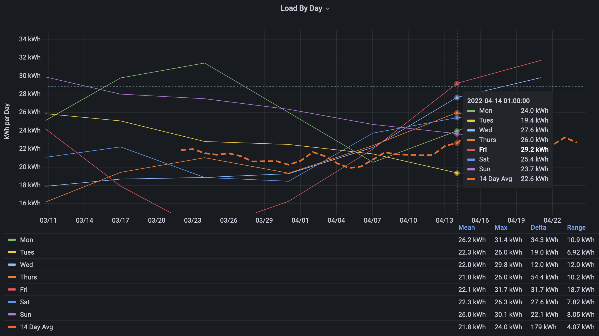
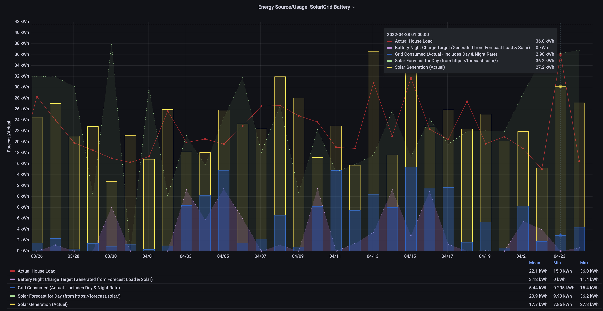

[**AlphaESS**](https://www.alphaess.com) are a provider of Solar/battery systems. As part of that system they provide a basic mobile application that allows reporting on usage and rudimentary control to charge the batteries nightly if desired(using nighttime rate). 
This page documents a smarter, integrated interface to the system.

## System Overview
1. [AlphaESS](https://www.alphaess.com) _- Domestic solar system: 20 Panels, Inverter, 2 batteries (11.4kWh)_
2. [MyEnergi - Eddie](https://myenergi.com/product/eddi/) _- A system to divert unused solar energy to heat the water rather than back to the grid._
3. [Home Assistant (HA)](https://www.home-assistant.io/) _- A home automation system installed on a small computer. When combined with specific hardware devices it enables various home elements can be automated. For Example:_
   _* turn lights on at a set time (eg: [Ikea bulbs](https://www.ikea.com/ie/en/cat/smart-lighting-36812/))_
   _* monitor power use of a device (eg: [TP-Link Energy Monitoring/Control Plugs](https://www.amazon.co.uk/TP-LINK-Tapo-Wireless-Required-P100/dp/B097YBXHTW?th=1))_
   
   _Many systems can be [integrated with Home Assistant](https://www.home-assistant.io/integrations/)._

4. [AlphaESS Proxy Addon](https://github.com/230delphi/hassio-addons/tree/main/alphaess-proxy-addon) _- A software package that can connect the AlphaESS and HA._
5. [MyEnergi Integration](https://github.com/cjne/ha-myenergi/) _- A software package that integrated the MyEnergi system with HA._
6. [Forecast.Solar Integration](https://www.home-assistant.io/integrations/forecast_solar/) _- An integration for HA to forecast solar production for the next hour or day._  

## Benefits
1. **Reporting/Data Display:** _All AlphaESS data is collected (every 10seconds) and available for display via HA custom dashboards._ 

   *Per the example below, custom dials display the current Energy produced (1,749W), that the battery is charging (679W) and usage in the house (including diversion for water). The lower graphs show over time the show solar production (in yellow), forecasted production (white dashed line), usage from the grid (blue) or battery charging (red).*
   

2. **Action based on status:** Combining this data with other elements of the system you can trigger events or notifications.

   *Some examples:*
   1. _IF_  **the water is cold** _AND_ **solar production is above a threshold** _THEN_ **enable the water heater**.
   2. _IF_ **solar production/battery is high**, _AND_ **the washing machine is not already in use** _AND_ **at a certain time of day** _THEN_ **send a notification to users phones that it is a good time to use the washing machine.**
   3. *Smart Night Rate Usage: charging the battery only to the level required: based on solar Forecast & expected Load for that day.*
   

## Smart Night Rate Usage
By default, the AlphaESS system allows 2 periods in the day to charge or block discharge of the battery using a cheaper night rate from the grid. You may choose the time of charging and to what leve the battery should be charged (eg: at 5am charge the battery to 80%).

The simplicity of this fixed schedule makes it difficult to optimise the system due to:
1. Seasonal & Daily variation in Solar Production.
2. House Load Varies daily: For example: washing on weekends or holiday mode!

Although excess production could heat water or be sent to the grid, neither may be valuable (eg: water may already be hot or feedin rate from grid is un-attractive). Using this HomeAssistant, custom configuration can allow rule based management of battery charging. Key elements were: 

1. **Solar Forecast** for the next day. Using the gps coordinates, direction & angle of panels [forecast.solar](https://forecast.solar/) evaluates the weather for the area and calculates an expected return on Solar Production that day.

   In the example below, we can see that the forecast is consistently overly optimistic on forecasted production. This may be down to configuration - it has been left static to ensure test consistency.

2. **Load Forecast** - based on historic use, the expected load by day of week can be forecast. Per the chart below, this household uses less energy on Tuesdays than Saturdays for example.

   In this example, the variation is not significant - accuracy of the forecast versus the variation in load by day means a rolling 14day average would be sufficient for most cases. However, behavioural changes within the house could further optimise. eg: no washing tuesday-thursday. 

3. **Holiday status** - based on presence in the house, or a calendar, disable any charging 

### Result
More improvements can be made, but it is clearly better than a fixed schedule or not using night rate at all.
Per the chart below, you can see that:
1. Load changes daily, but there are some patterns. Behavioural changes could reduce the variablity of this input. The system is programed to plan based on the average for that weekday. For example: At 5am tuesday morning, forecast the usage based on the average of the last 4 tuesdays. 
2. Solar Forecast accuracy is ~60% (TODO map this out clearly). Given the nature of local weather patterns, this will remain the largest variable.
3. Energy stored at night rate varies as expected from 0-11.4kWh (full battery). 
4. The date highlighted (23 April) shows the solar Forecast of 36kWh was expected to meet the load for the day. The load for the day was 36kWh, but the solar production was only 27kWh resulting in a draw from the grid at day time rates of 2.9kWh. The remaining 6kWh were drawn from the battery from previous days.
5. It is not clear on this diagram, even with full batteries, the system is limited to 4.5amp draw. At peak Energy times (consider washing and cooking at the same time) there will always be draw from the grid. TODO: diagram to represent
6. It is difficult to chart all the data in a meaningful way! Next version will come up with some clearer measures of the smart system effectiveness! 

TODO Areas for Improvement:
1. Visualisation: more data to show a more clear distribution of night rate versus day rate electricity usage.
2. Share: current config/scripts in use are custom. generalise, and publish.
3. Enhancement: HA Addon could be evolved to manage more entities directly. 
4. Enhancement: HA addon could also provide more service driven automations.
5. Enhancement: could MQTT be removed?
