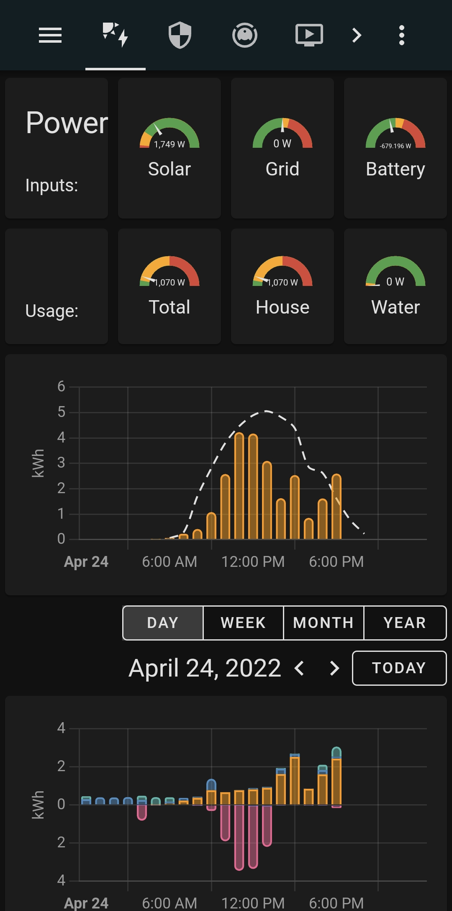
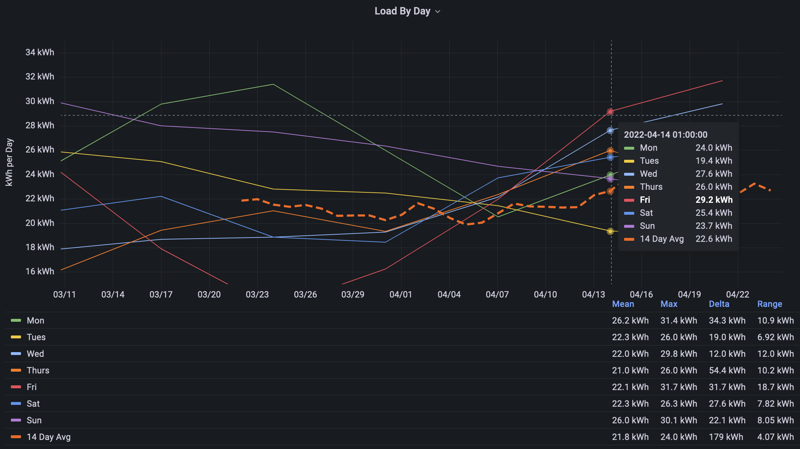
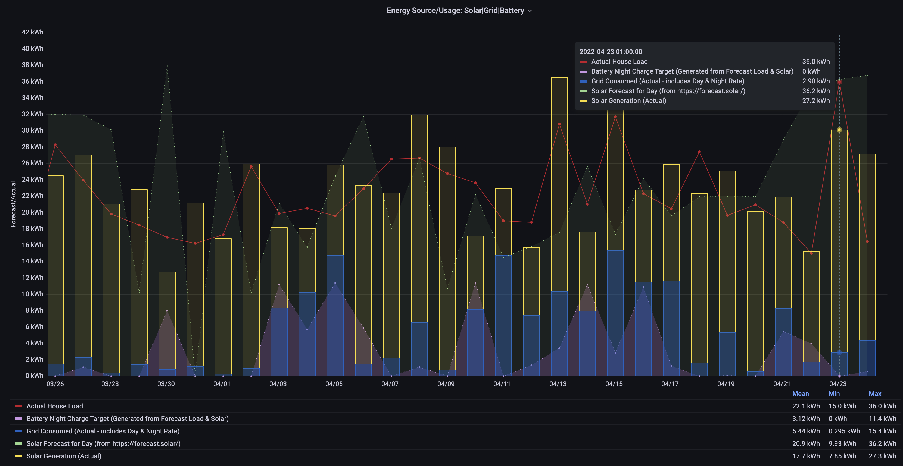

[**AlphaESS**](https://www.alphaess.com) are a provider of Solar/battery systems. A basic mobile application allows reporting on usage and rudamentory control to charge the batteriess nightly if desired(using night time rate). 
This page documents a more advanced interface to the system.

## System Overview
1. [**AlphaESS**](https://www.alphaess.com) System - A basic solar system: 20 Panels, Inverter, 2 batteries (11.4kWh)
2. [MyEnergie - Eddie](https://myenergi.com/product/eddi/) - A system to divert unused solar energy to heat the water rather than back to the grid.
3. [**Home Assistant (HA)**](https://www.home-assistant.io/) - A home automation system installed on a small computer; When combined with specific hardware devices it enables various home elements can be automated:
   * turn lights on at a set time (eg: [Ikea bulbs](https://www.ikea.com/ie/en/cat/smart-lighting-36812/))
   * monitor power use of a device (eg: [TP-Link Energy Monitoring/Control Plugs](https://www.amazon.co.uk/TP-LINK-Tapo-Wireless-Required-P100/dp/B097YBXHTW?th=1))
   
   See the many systems that can be "integrated" on the [Home Assistant Integrations Page](https://www.home-assistant.io/integrations/)

4. [HA Addon](https://github.com/230delphi/hassio-addons/tree/main/alphaess-proxy-addon) software package that can connect the AlphaESS and HA.
5. [MyEnergie Integration](https://github.com/cjne/ha-myenergi/) - software package that integrated the MyEnergi system with HA.

( TODO would Diagrams be useful?)

## Benefits
1. **Reporting/Data Display:** All AlphaESS data is collected (every 10seconds) and available for display via HA custom dashboards. 

   *Per the example below, a custom dashboard shows the current Energy produced (1,749W), that the battery is charging (679W) and load usage by the house. The lower Graphs show solar production (in yellow), forecasted production (white dashed line), usage from the grid (blue) or battery charging (red).*
   

2. **Action based on status:** Combining this data with other elements of the system you can trigger events or notifications.

   *Some examples:*
   1. *If the water is cold and solar production is above a threshold enable the water heater.*
   2. *If solar production/battery is high, and the washing machine is not already in use and at a certain time of day - send a notification to users phones that it is a good time to use the washing machine.*
   3. *Smart Night Rate Usage - charging the battery only to the level required: based on solar Forecast & expected Load for that day.*
   

## Smart Night Rate Usage
By default, the AlphaESS system allows 2 schedules to charge the battery using a night rate from the grid. You may choose the time of charging and to what leve the battery should be charged (eg: at 5am charge the battery to 80%).

The simplicity of this fixed schedule makes it difficult to optimise the system due to:
1. Seasonal & Daily variation in Solar Production.
2. House Load Varies daily eg: washing on weekends or holiday mode!)

Although excess production could heat water or sent to the grid, neither may be valuable to us. With this setup, custom HA configuration allows rule based management. In this system, the key elements were: 

1. Solar Forecast for the next day. Using the gps coordinates, direction & angle of panels [forecast.solar](https://forecast.solar/) evaluates the weather for the area and calculates an expected return on Solar Production that day.

   In the example below, we can see that the forecast is consistently overly optimistic on forecasted production. This may be down to configuration - it has been left static to ensure test consistency.

3. Load Forecast - based on historic use, the expected load by Day of week can be extrated. Per the chart below, this household uses less energy on Tuesdays than Saturdays for example.

   In this example, the variation is not significant - accuracy of the forecast verus the variation in load by day means an rolling 14day average would be sufficient for most cases. However, behavioural changes within the house could further optimise. eg: no washing tuesday-thursday. 

4. Holiday status - based on presence in the house, or a calendar, disable any charging 

### Result
The solution is not perfect, but a) given we have enough hotwater for our needs, b) rate proposed for exported engergy is so low; it is clearly better than a fixed schedule or not using night rate at all.

TODO Areas for Improvement:
1. More data to show clearer distribution of night rate versus day rate electricity usage.
2. Current config/scripts in use are custom. generalise, and publish.
3. HA Addon could be evolved to manage more entities directly; 
4. HA addon could also provide more service driven automations.
